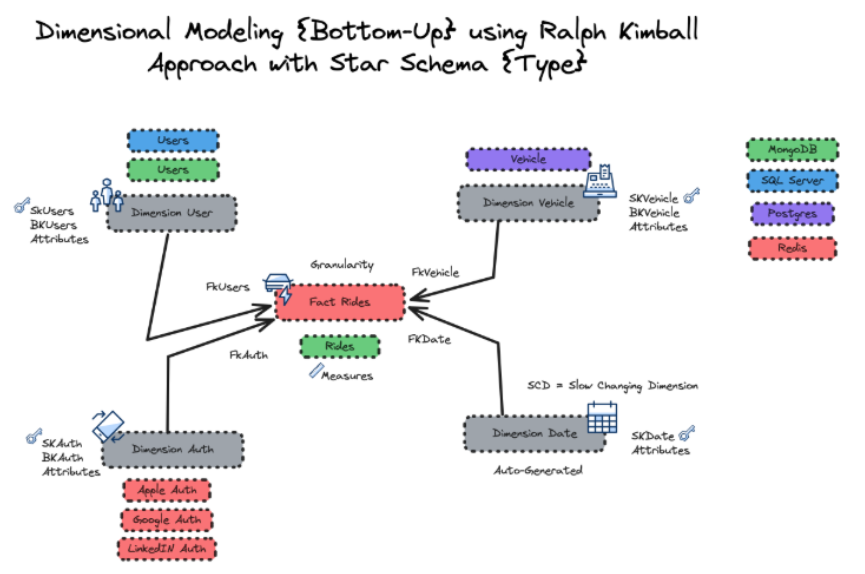
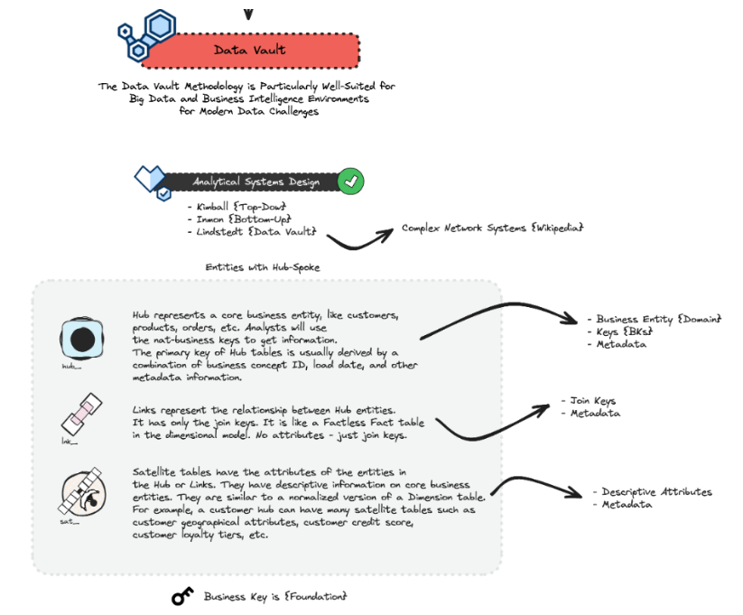
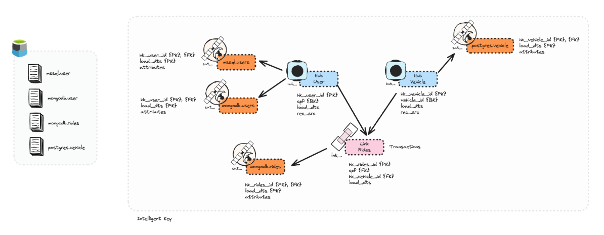
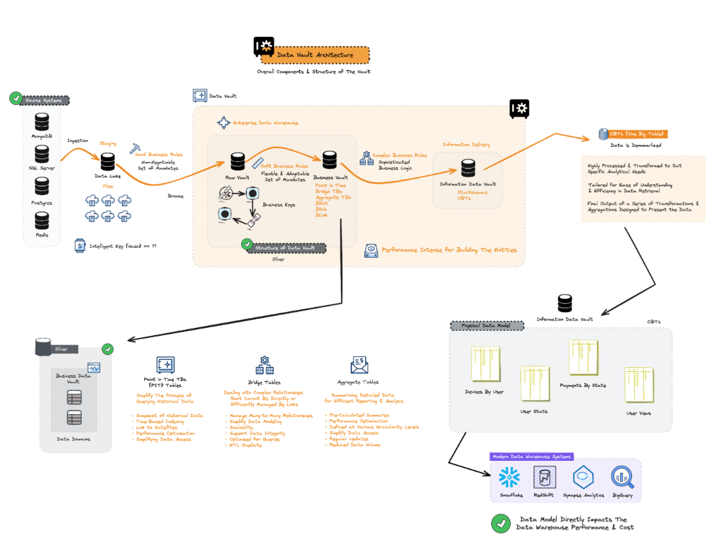

# Data Vault: A Modelagem de Dados para Integração e Análise

## Seção 1: O que é Data Vault?

O Data Vault é uma metodologia de modelagem de dados que nasceu no início dos anos 2000. Criado por Dan Linstedt, o Data Vault foi projetado para resolver problemas de integração de dados complexos. Ele combina conceitos de modelagem dimensional com elementos de modelagem entidade-relacionamento, tornando-o uma ferramenta poderosa para empresas que precisam lidar com grandes volumes de dados.

Data Vault nada mais é do que a organização da criação das tabelas por DOMAIN dentro do UC (Unit Catalog).
Domain: é a área de negócio, ou seja, o assunto que a tabela irá tratar, como por exemplo: cliente, produto, vendas, etc.

## Seção 2: Multi-Hop Architeture (Medalion)

- Bronze: As_Is with Metadata;
- Silver: Data Vault Design;
- Gold: OBT (One Big Table);

## Seção 3: Benefícios do Data Vault

- Integração de Dados: O Data Vault é projetado para lidar com fontes de dados múltiplas e complexas.
- Flexibilidade: Permite mudanças na estrutura de dados sem a necessidade de reengenharia completa.
- Histórico de Dados: Mantém o histórico de alterações, tornando mais fácil rastrear mudanças.
- Desempenho: Otimiza o desempenho em ambientes de Big Data.

## Seção 4: Implementando o Data Vault

Antes de implementar, é crucial entender os componentes-chave do Data Vault:

- Hubs: Representam entidades centrais, como clientes ou produtos.
- Satellites: Armazenam atributos descritivos.
- Links: Conectam hubs e satellites, permitindo a criação de relações complexas.

## Seção 5: O Futuro do Data Vault

O Data Vault está se tornando cada vez mais popular, especialmente com o crescimento do Data Lakehouse. Descubra como o Data Vault se integra com tecnologias modernas e por que ele é fundamental para o futuro da análise de dados.

## Conclusão

O Data Vault é uma ferramenta indispensável para qualquer empresa que lida com grandes volumes de dados. Combinando flexibilidade, desempenho e capacidade de lidar com dados complexos, o Data Vault é o futuro da modelagem de dados.

# Visualização da Arquitetura

## Modelo Star Schema - Ralph Kimball

## Elementos do Data Vault

## Raw Data Vault

## Full Data Vault Architecture

